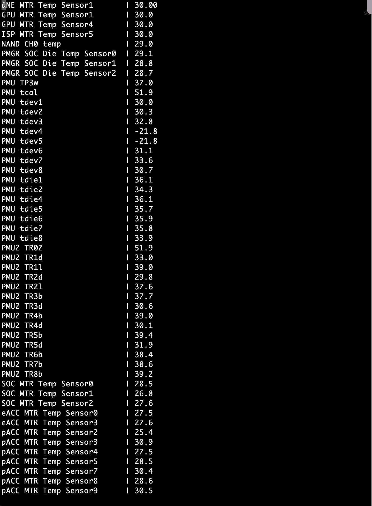

# Temperature Sensor Monitor for Apple Silicon M1

## Now easy run sensors window from applet M1 Sensors

- `temp_sensor.m`: modified on the Objective-C [code](https://github.com/freedomtan/sensors/blob/master/sensors/sensors.m) for iOS sensor by [freedomtan](https://github.com/freedomtan);

- `monitor.py`: a wrapper for `temp_sensor.m` output for monitoring temperature in the terminal.

## Usage

Compile `temp_sensor.m` (by `clang -Wall -v temp_sensor.m -framework IOKit -framework Foundation -o temp_sensor`, Xcode on M1 mac needed). Then

`./temp_sensor | ./monitor.py` or `./temp_sensor`

Only test with my Macbook air with M1. Please check your mac's `ioreg -lfx` output to make changes in `temp_sensor.m` if needed.

## References

For **better names** (e.g. what is `PMU TP3w` ?) for the sensors, please refer to

https://github.com/exelban/stats/blob/master/Modules/Sensors/values.swift

https://github.com/acidanthera/VirtualSMC/blob/master/Docs/SMCSensorKeys.txt

Here is a similar code in swift for getting sensor values using IOKit (for intel Mac)

https://github.com/exelban/stats/blob/master/Modules/Sensors/values.swift

For intel Mac, an easier way to get sensor infomation:

`sudo powermetrics`

## Demo: screen shot 
- screen shot

<!---

--->

